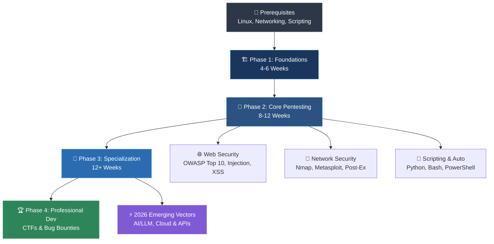

# 🎯 Penetration Testing Roadmap (2026 Edition)

<div align="center">

[](https://github.com/SagarBiswas-MultiHAT/penetration-testing-roadmap/stargazers)
[](https://github.com/SagarBiswas-MultiHAT/penetration-testing-roadmap/network/members)
[](https://github.com/SagarBiswas-MultiHAT/penetration-testing-roadmap/commits/main)
[](LICENSE)
[](CONTRIBUTING.md)
[](resources/tryhackme-rooms.md)

**A structured, comprehensive 60-week curriculum to master penetration testing, web security, network hacking, and ethical hacking from scratch.**

[🌐 Support The Open Source Ecosystem](#Support-the-Open-Source-Ecosystem) • [🥽 500+ Free Labs](resources/tryhackme-rooms.md) • [🛠️ Tools Directory](resources/tools-directory.md) • [🤝 Contribute](CONTRIBUTING.md)

</div>

---

## 📖 Overview

Feeling overwhelmed by the vast world of cybersecurity? **You are not alone.** Penetration testing requires a blend of networking, Linux/Windows administration, web architecture, and security methodology. 

This repository provides a step-by-step, self-paced learning path designed to take you from absolute zero to a market-ready penetration tester through hands-on practice, vulnerable labs, real-world CTFs, and free certifications.

---

## 🗺️ Visual Learning Flowchart



---

## ⚡ What's New in the 2026 Edition?

Cybersecurity moves fast. The 2026 edition introduces modern attack vectors and defense paradigms:

* **🤖 AI & LLM Security**: Prompt injection attacks, indirect prompt hijacking, model inversion, and auditing OWASP Top 10 for LLM Applications.
* **☁️ Cloud Pentesting**: AWS/Azure/GCP identity misconfigurations, IAM privilege escalation, and container escape techniques (Docker/K8s).
* **🔌 API & Microservices**: GraphQL introspection abuse, gRPC security testing, OAuth 2.0 / JWT misconfigurations, and BOLA (Broken Object Level Authorization).
* **📦 Supply Chain & CI/CD Security**: Poisoned pipeline execution (PPE), dependency confusion, and auditing GitHub Actions workflows.
* **🛡️ Zero Trust Architecture**: Bypassing identity-aware proxies, Mutual TLS (mTLS) testing, and microsegmentation evasion.

---

## 🌟 Featured Highlight: 500+ Free TryHackMe Rooms

One of the largest open-source collections of free security labs:

```
├── 🐧 Linux Fundamentals (Part 1-3)
├── 🪟 Windows Fundamentals
├── 🔍 Reconnaissance & OSINT (Google Dorking, Shodan, Passive Recon)
├── 🌐 Web Hacking (SQLi, XSS, CSRF, SSRF, LFI/RFI, IDOR)
├── 🔐 Active Directory & Privilege Escalation
├── 🦠 Reverse Engineering & Malware Analysis
└── 🏆 200+ CTF Rooms (Easy, Medium, Hard, Insane)
```

👉 **[Access the Full Checklist & Progress Tracker](resources/tryhackme-rooms.md)**

---

## 📜 Certification & Career Roadmap

```
Entry-Level ─────────► Professional ─────────► Expert Level
  • CompTIA Sec+         • OSCP                  • OSEP
  • CompTIA PenTest+     • CEH                   • GPEN
  • ISC2 CC (Free)       • GCIH                  • OSCE
```

👉 **[Access the Full Certifications & Career Guide](resources/certifications.md)**

> 🧭 **Looking for career roadmaps across 35 distinct roles?**
> Check out **[Awesome Cybersecurity Paths](https://github.com/SagarBiswas-MultiHAT/awesome-cybersecurity-paths)** for a complete breakdown of 35 roles across Offensive, Defensive, and GRC, 100+ tools, cert paths, and 10 enterprise architectures.

---

## ⚖️ Legal & Ethical Disclaimer

> [!CAUTION]
> **Authorized Testing Only**: Penetration testing without explicit written authorization is illegal and punishable under computer crime laws (e.g., Computer Fraud and Abuse Act). Always perform testing strictly within authorized environments, lab VMs, or approved bug bounty scopes. Follow responsible disclosure practices at all times.

---
<a id="companion-ecosystem"></a><a id="flagship-ecosystem"></a><a id="Support-the-Open-Source-Ecosystem"></a>
## ⭐ Support the Open-Source Ecosystem

If you find this roadmap or our companion resources helpful, please consider starring ⭐ the repositories on GitHub! Your support increases visibility, helps more aspiring security professionals discover free high-quality education, and keeps these community projects thriving:


### 🥷 [The BlackHAT Roadmap 2027](https://github.com/SagarBiswas-MultiHAT/The-BlackHAT-roadmap)
[](https://github.com/SagarBiswas-MultiHAT/The-BlackHAT-roadmap)
[](https://github.com/SagarBiswas-MultiHAT/The-BlackHAT-roadmap/network/members)

**The complete hacking & penetration testing roadmap from beginner to elite.**
* **Massive Technical Scope**: 44,982 lines of rigorous technical documentation accompanied by 150+ visual diagrams covering attack chains, systems architecture, and exploitation flows.
* **Specialized Offensive Operations**: In-depth coverage of OPSEC survival, web security, Active Directory dominance, binary exploitation, EDR evasion mechanisms, and 0-day vulnerability research.
* **Arsenal & Payloads**: 300+ cataloged tools, 200+ MITRE ATT&CK techniques, custom weaponized C & Rust payloads, and modern AI security resources.
* **Learning Assets**: Hands-on lab setup guides, curated books, top courses, technical blogs, and CTF/practice platform recommendations.

👉 **[Access The BlackHAT Roadmap 2027](https://github.com/SagarBiswas-MultiHAT/The-BlackHAT-roadmap)**

---

### 🧭 [Awesome Cybersecurity Paths](https://github.com/SagarBiswas-MultiHAT/awesome-cybersecurity-paths)
[](https://github.com/SagarBiswas-MultiHAT/awesome-cybersecurity-paths)
[](https://github.com/SagarBiswas-MultiHAT/awesome-cybersecurity-paths/network/members)

**A comprehensive cybersecurity career roadmap and handbook.**
* **35 Industry Roles**: Comprehensive role breakdowns and skill profiles across Offensive Security, Defensive Operations (SOC Analyst, Incident Responder, Threat Hunter), and Governance, Risk & Compliance (GRC).
* **Tool & Skill Matrix**: 100+ industry tools mapped directly to job expectations, daily responsibilities, and technical proficiencies.
* **Certification Milestones**: Tailored credential tracks guiding learners from entry-level foundational certs to specialized professional credentials.
* **Enterprise Architectures**: 10 real-world cybersecurity architecture blueprints showing enterprise defense and operational workflows.

👉 **[Access Awesome Cybersecurity Paths](https://github.com/SagarBiswas-MultiHAT/awesome-cybersecurity-paths)**

---

### 📚 [Awesome Cybersecurity Books](https://github.com/SagarBiswas-MultiHAT/awesome-cybersecurity-books)
[](https://github.com/SagarBiswas-MultiHAT/awesome-cybersecurity-books)
[](https://github.com/SagarBiswas-MultiHAT/awesome-cybersecurity-books/network/members)

**A curated collection of 70+ free cybersecurity books organized by domain and difficulty.**
* **Difficulty Progression**: Structured learning tracks organized from 🟢 Beginner → 🟡 Intermediate → 🔴 Advanced to build knowledge step by step.
* **Comprehensive Domains**: Curated titles covering ethical hacking, penetration testing, exploit development, malware analysis, reverse engineering, web security, and mobile security.
* **Zero Paywall**: 100% free, community-maintained collection ensuring high-quality security literature is accessible without paywalls or subscriptions.

👉 **[Access Awesome Cybersecurity Books](https://github.com/SagarBiswas-MultiHAT/awesome-cybersecurity-books)**

---

### 📓 [Research Notebooks & Field Manuals](https://sagarbiswas-multihat.github.io/notebooks/)

**Curated technical notebooks and field manuals with an interactive in-browser reader.**
* **Interactive In-Browser Reader**: Over 32 modular notebooks, field manuals, and study vaults equipped with dark-mode reading and code demonstrations.
* **Core Cybersecurity & OSINT**: Handbooks including Google Dorks: The Complete Handbook, Understanding Phishing, and strategic career path guides.
* **Networking & Infrastructure**: Technical field manuals detailing computer networking fundamentals, DNS architecture, and network protocols.
* **Programming for Security**: Complete practical tracks for Python in cybersecurity, Bash automation, C/C++ data structures, and web technologies.

👉 **[Access Research Notebooks & Field Manuals](https://sagarbiswas-multihat.github.io/notebooks/)**


---

## 🤝 Contributing & Community

Contributions make this roadmap better for everyone! Whether you want to add a new TryHackMe room, fix a broken link, or translate a section:

- Read our **[CONTRIBUTING.md](CONTRIBUTING.md)** guide.
- Suggest a resource via **[Resource Suggestion Template](.github/ISSUE_TEMPLATE/resource-suggestion.md)**.
- Report dead/paywalled links via **[Broken Link Report Template](.github/ISSUE_TEMPLATE/broken-link-report.md)**.

---

<div align="right">

*Maintained with ❤️ by [@SagarBiswas-MultiHAT](https://github.com/SagarBiswas-MultiHAT) and the global InfoSec community under the [CC BY-SA 4.0 License](LICENSE).*

</div>

---